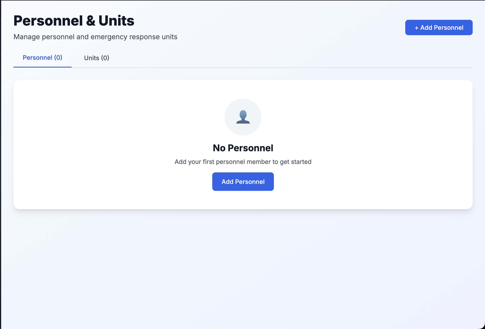
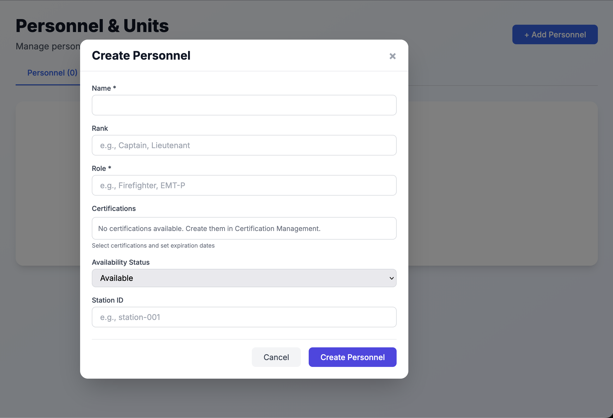
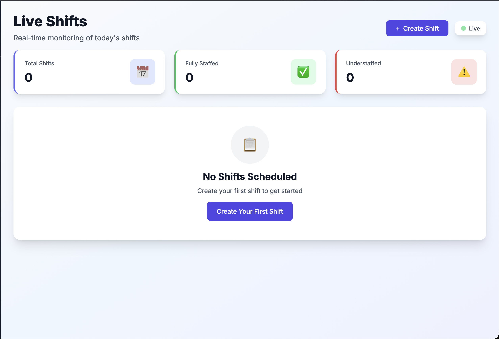
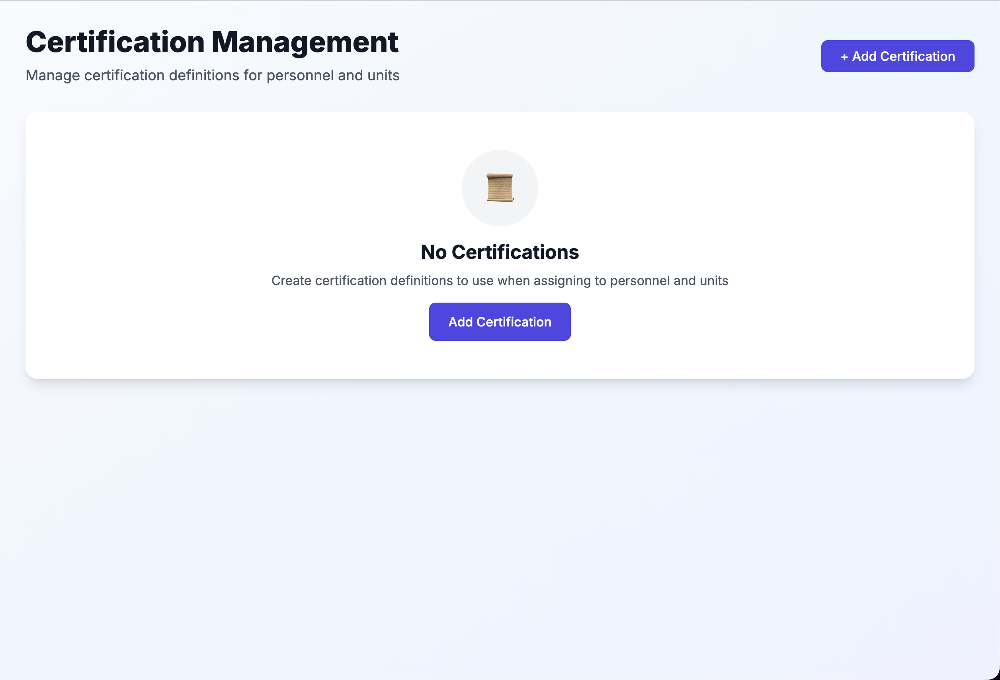
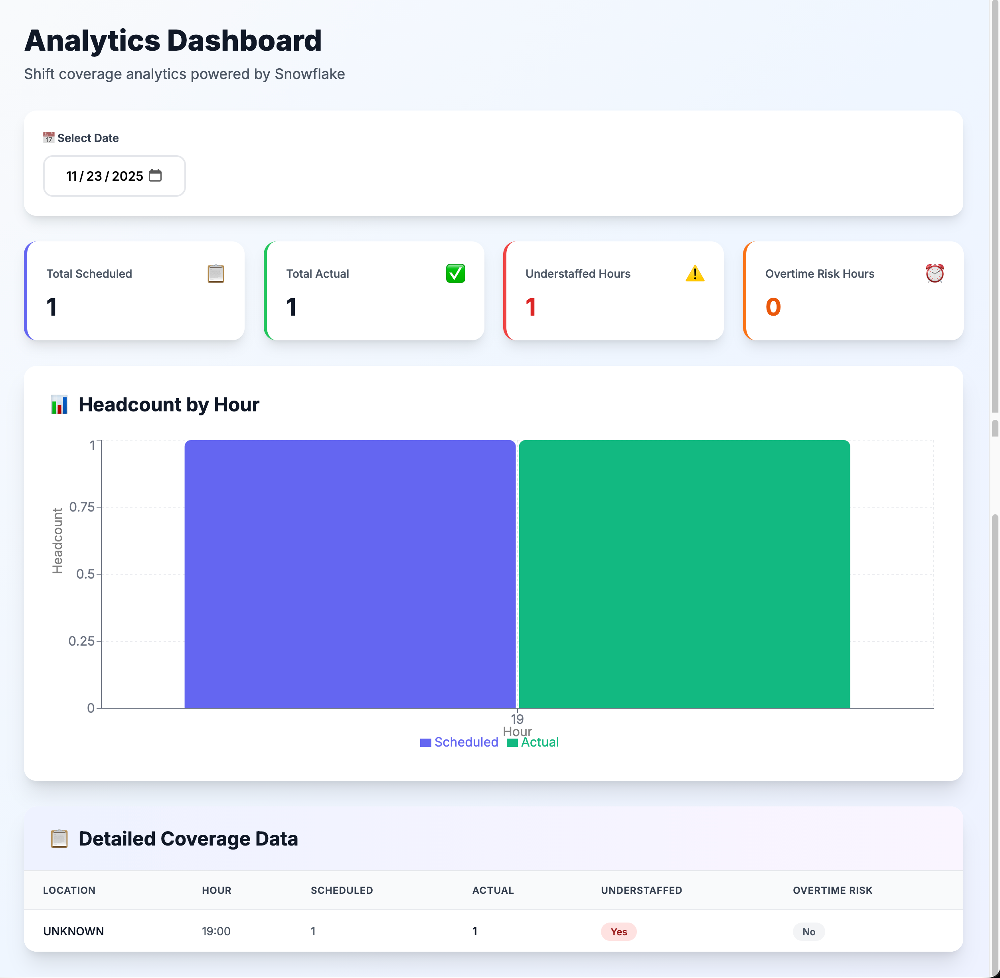

# Emergency Readiness Dashboard

An operations-focused full-stack platform for monitoring emergency crew readiness, staffing gaps, certification exposure, and warehouse-backed trend analytics with live updates.

## Project Positioning

This project is strongest when it is presented as a command-and-readiness product, not a generic dashboard. The core story is:

- Real-time readiness scoring for emergency units.
- Event-driven backend architecture with Kafka and WebSockets.
- Snowflake analytics used to explain risk windows, staffing degradation, and certification impact.
- FastAPI and Pydantic used to keep contracts strict and operational workflows reliable.

## Screenshots

### Personnel Dashboard View



### Update Personnel View



### Shift Detail View



### Certification Compliance View



### Snowflake Analytics Example View



## Tech Stack

### Backend
- **FastAPI**: REST API surface and WebSocket endpoints
- **Pydantic**: strict schema validation for operational entities and API contracts
- **Kafka**: event streaming backbone for low-latency data flow
- **Snowflake**: warehouse and analytics layer
- **SQLite**: lightweight local development persistence

### Frontend
- **Next.js 14** with TypeScript
- **React** client components for live dashboards
- **WebSockets** for push-based readiness updates
- **Recharts** for analytics visualizations

### Data Pipeline
- **Snowflake Streams & Tasks** for automated transformation
- **Warehouse aggregates** for hourly coverage and readiness trend analysis

## 🚀 Quick Start

See [SETUP.md](./SETUP.md) for detailed setup instructions.

**Quick commands:**
```bash
# Backend
cd backend
python -m venv venv
source venv/bin/activate
pip install -r requirements.txt
cp .env.example .env
uvicorn app.main:app --reload --host 0.0.0.0 --port 8000

# Frontend (new terminal)
cd dashboard
npm install
echo "NEXT_PUBLIC_API_BASE_URL=http://localhost:8000" > .env.local
npm run dev
```

Open **http://localhost:3000** to view the dashboard.

**Note:** The app works with mock Kafka/Snowflake services for development. See [SETUP.md](./SETUP.md) for configuring real services.

## Project Structure

```
workforce-shift-dashboard/
├── backend/
│   ├── app/
│   │   ├── api/          # REST API routers
│   │   ├── models/       # Pydantic models
│   │   ├── services/     # Business logic (Kafka, Snowflake)
│   │   └── websocket/    # WebSocket manager
│   ├── tests/
│   ├── requirements.txt
│   ├── Dockerfile
│   └── .env.example
├── data-pipeline/
│   └── snowflake/
│       ├── 01_schema.sql
│       ├── 02_stage_and_pipe.sql
│       ├── 03_streams_and_tasks.sql
│       └── 04_analytics_views.sql
├── dashboard/
│   ├── app/              # Next.js app directory
│   ├── components/       # React components
│   ├── package.json
│   └── .env.example
└── docs/
    └── architecture.md
```

## Environment Variables

### Backend (.env)
```bash
# Kafka (Confluent Cloud)
KAFKA_BOOTSTRAP_SERVERS=pkc-xxxxx.region.provider.confluent.cloud:9092
KAFKA_USERNAME=your_api_key
KAFKA_PASSWORD=your_api_secret

# Snowflake
SNOWFLAKE_ACCOUNT=your_account_identifier
SNOWFLAKE_USER=your_username
SNOWFLAKE_PASSWORD=your_password
SNOWFLAKE_ROLE=ACCOUNTADMIN
SNOWFLAKE_WAREHOUSE=COMPUTE_WH
SNOWFLAKE_DATABASE=WORKFORCE_DB
SNOWFLAKE_SCHEMA=RAW

# Application
JWT_SECRET=your-secret-key
CORS_ORIGINS=http://localhost:3000,https://your-frontend.vercel.app
```

### Frontend (.env.local)
```bash
NEXT_PUBLIC_API_BASE_URL=http://localhost:8000
```

## Deployment

### Backend (Render/Railway)

1. Push code to GitHub
2. Create new service in Render/Railway
3. Connect GitHub repository
4. Set build command: `cd backend && pip install -r requirements.txt`
5. Set start command: `cd backend && uvicorn app.main:app --host 0.0.0.0 --port $PORT`
6. Configure all environment variables
7. Deploy

### Frontend (Vercel)

1. Push code to GitHub
2. Import project in Vercel (select `dashboard/` folder)
3. Set environment variable: `NEXT_PUBLIC_API_BASE_URL=https://your-backend.onrender.com`
4. Deploy

## What The Product Should Demonstrate

- **Real-time command visibility**: show which units are deployable right now and which ones are degraded.
- **Operational analytics**: identify where scheduled staffing diverges from actual staffing and when risk windows open.
- **Credential-aware readiness**: treat certifications as a deployment constraint, not just profile metadata.
- **Scalable backend design**: separate ingestion, processing, and presentation layers with Kafka and Snowflake.
- **Strict API contracts**: use Pydantic models to validate mission-critical input before it reaches persistence layers.

## Local Demo Behavior

- When Snowflake is unavailable, the backend now falls back to local readiness-derived analytics instead of returning empty arrays.
- If no local assignments exist yet, the analytics page shows deterministic demo coverage so the product still presents a meaningful operational story during portfolio review.
- Once Snowflake is configured and the warehouse tables are populated, the UI automatically uses real warehouse data.

## API Endpoints

### REST API
- `POST /api/personnel` - Create personnel profile
- `GET /api/personnel` - List all personnel
- `POST /api/units` - Create unit definition
- `GET /api/units` - List all units
- `POST /api/unit-assignments` - Assign personnel to unit
- `GET /api/readiness/units/{unit_id}` - Get unit readiness status
- `GET /api/readiness/all-units` - Get all units readiness
- `GET /api/certifications/expiring` - Get expiring certifications
- `GET /api/certifications/expired` - Get expired certifications

### WebSocket
- `ws://<backend_url>/ws/unit-readiness/{unit_id}` - Real-time unit readiness updates

See http://localhost:8000/docs for full interactive API documentation.

## Documentation

- [SETUP.md](./SETUP.md) - Detailed setup and installation guide
- [SNOWFLAKE_SETUP.md](./SNOWFLAKE_SETUP.md) - Snowflake configuration and data pipeline setup
- [docs/architecture.md](./docs/architecture.md) - System architecture and design

## Recommended Next Improvements

- Replace basic scheduled-vs-actual analytics with station-level readiness gap, coverage rate, and risk-hour metrics.
- Add historical readiness trend endpoints so the analytics page can compare current posture against prior days.
- Normalize Snowflake schemas and naming so `RAW`, `ANALYTICS`, and API contracts describe the same entities consistently.
- Regenerate screenshots after the UI refresh so the GitHub presentation matches the current product quality.

## Contributing

This is a portfolio project demonstrating real-time systems, analytics engineering, and full-stack application design. Fork and extend as needed.
