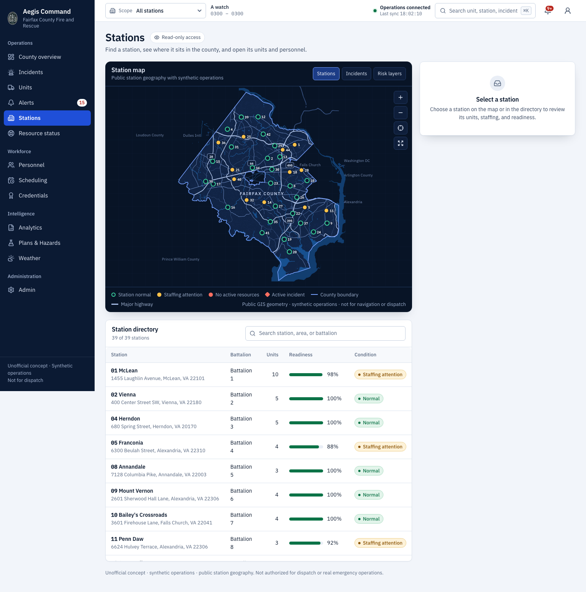
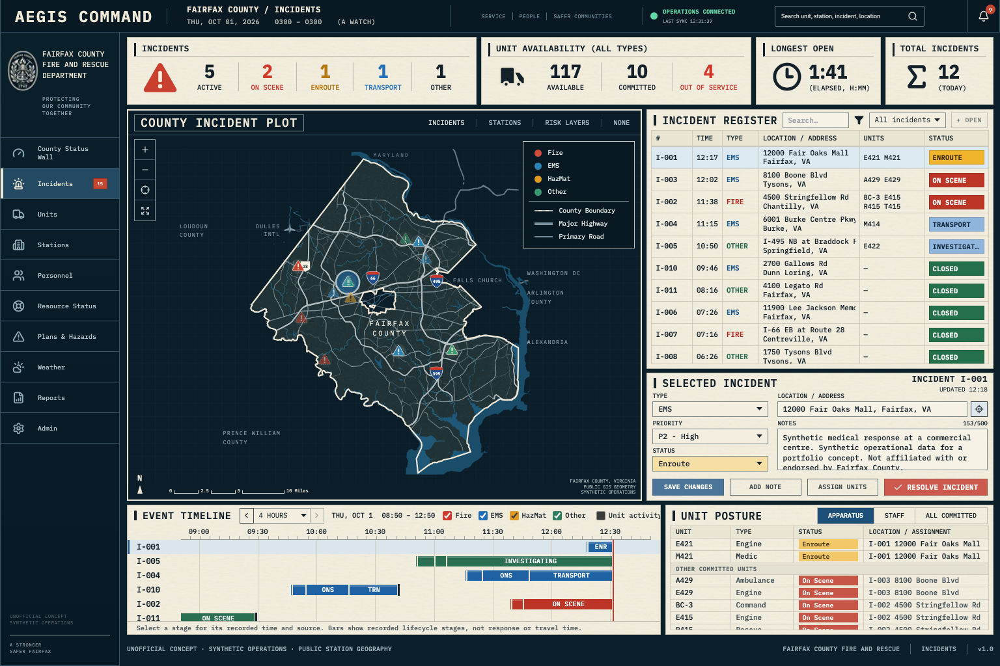
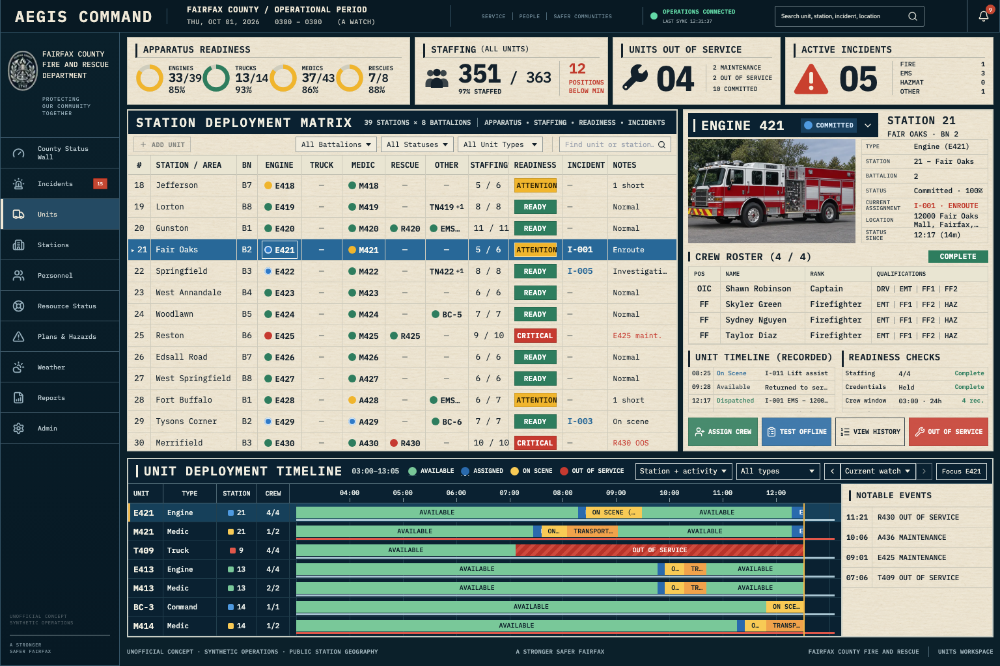
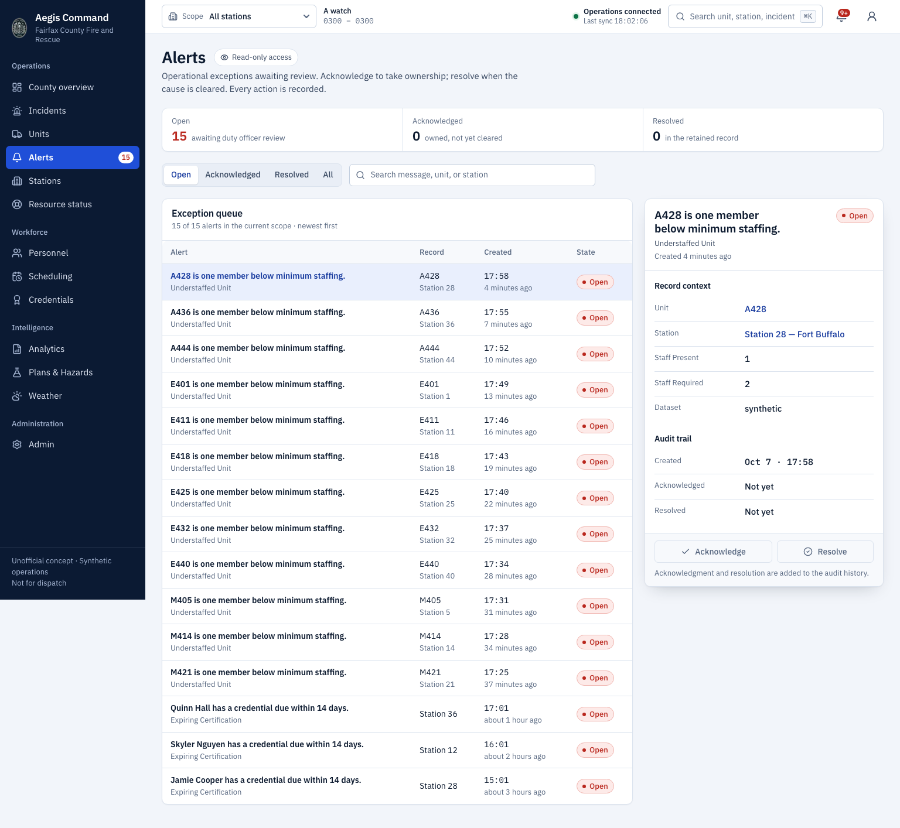
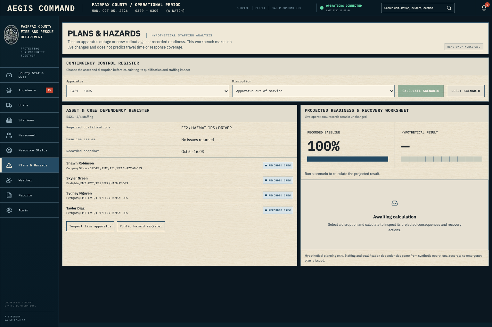

# Aegis Command

A map-led emergency coordination concept built with FastAPI, Next.js, normalized PostgreSQL, OIDC identity, Kafka priority channels, Redis fan-out, and a tenant-scoped Snowflake analytics deployment.

The interface is one calm operating deck: cool-white workspaces for reading and deciding, a deep navy navigation rail, cobalt for selection and the primary action, and a dark stage for the county map and timelines. Each page leads with one primary workspace; a selected record opens in an inspector beside it, or in a full-height drawer on smaller screens. It is designed for fast exception scanning by duty officers without presenting itself as a CAD, dispatch, or patient-care system. See [product context](PRODUCT.md) and [design system](DESIGN.md).

**Target:** Fairfax County Fire and Rescue Department. **Unofficial portfolio concept—not affiliated with or endorsed by Fairfax County.** Public station geography is paired with 131 synthetic units, 1,450 synthetic personnel, eight synthetic battalion assignments, and a 363-position staffing model. No real incidents, personnel records, patient data, or county-system connections are included. See [target research and provenance](docs/target-research.md).

## Product tour

Navigation is grouped into Operations, Workforce, Intelligence, and Administration. Station scope, connection freshness, open alerts, and command search (⌘K) stay in the top bar; search returns workspaces plus stations, units, and active incidents from loaded data.

### County overview


A compact readiness summary sits above the county map and a queue of active incidents and open alerts. The map plots 39 keyboard-accessible station markers on locally committed [Fairfax County iCare GIS](https://www.fairfaxcounty.gov/gisint2/rest/services/DTA/iCare/MapServer) geometry at a single Web Mercator scale, with station, incident, and risk layers, zoom, and fullscreen. Resource posture and the downloadable handover brief follow below. [View on mobile](pictures/aegis-command-mobile.png).

### Stations and resource status



The station directory, the map, and the station inspector share one selection, which survives a reload; the inspector opens that station's units and personnel. Resource status presents apparatus, special teams, and supply availability in tabs with comparison bars.

### Incidents



Incidents open on a readable register with the selected record beside it: the editable worksheet (type, priority, status, location, timestamped notes), unit assignment, confirmed resolution, unit posture, and the recorded lifecycle. Map and Timeline are alternate views of the same selection. Timeline stages come from timestamped audit records; the timeline does not claim response or travel times. [View on mobile](pictures/aegis-incidents-mobile.png).

### Units



The apparatus register groups every synthetic unit under its station, with an optional coverage matrix and a deployment history that rebuilds recorded service states, incident stages, and crew windows from the audit history; intervals with no record are shown as such rather than assumed available. Authorized users can assign crew, test a non-destructive offline scenario, and record out-of-service, maintenance, or return-to-service changes after confirmation. [View on mobile](pictures/aegis-units-mobile.png).

### Alerts



A focused exception queue with state filters. Each alert shows its unit and station context and its audit trail; acknowledgment and resolution are recorded.

### Personnel


Search and status filters lead; the station distribution is an expandable overview that filters the roster. The profile carries availability, credential dates, current assignments, deep links, and guarded archival. Availability is not qualification clearance. [View on mobile](pictures/aegis-personnel-mobile.png).

### Scheduling


The duty timeline plots recorded shift windows across the day, including overnight continuation. Countywide shifts are grouped by actual apparatus assignments, and the selected shift's coverage ledger and roster open beside it. Operators can create shifts, validate windows, assign personnel, clock crew in and out, and cancel shifts after confirmation. [View on mobile](pictures/aegis-shifts-mobile.png).

### Credentials


The expiration horizon and renewal queue lead; selecting a band opens the matching workforce risk. Credential definitions and unit requirements are separate tabs, keeping requirements distinct from verified crew qualifications. [View on mobile](pictures/aegis-certifications-management-mobile.png).

### Analytics


One analysis at a time: a prominent chart, short findings, and expandable evidence. Station comparison traces current readiness to staffing and credential exceptions and links to the accountable record. Trend windows, baseline comparison, station scope, five report views, and CSV export support planning without presenting current attendance as history or claiming predictive response coverage. [View on mobile](pictures/aegis-analytics-mobile.png).

### Plans & Hazards



Choose an apparatus outage or recorded crew callout, compare the recorded baseline with the hypothetical result, and read the returned recovery actions. Changing an input clears the result; nothing changes live records, and calculation remains permission-gated. [View on mobile](pictures/aegis-plans-mobile.png).

### Weather


The selected [National Weather Service](https://www.weather.gov/documentation/services-web-api) forecast period and active alerts lead, followed by temperature and wind instruments. Source time, stale and unavailable states, and missing readings stay explicit. Forecasts are not observed weather and do not replace official warning or dispatch channels. [View on mobile](pictures/aegis-weather-mobile.png).

### Administration


Four sections: identity and effective access, response checks that state what each verified browser response establishes (not independent infrastructure health), a filterable audit history, and the permission-gated, confirmed demo reset. [View on mobile](pictures/aegis-admin-mobile.png).

---

## Tech Stack

| Layer | Technology |
|---|---|
| Frontend | Next.js 16 · React 19 · TypeScript · TanStack Query · Zod · Radix UI · Recharts |
| API | FastAPI · Pydantic v2 · Python 3.11+ |
| Streaming | Kafka protocol (local Redpanda) · transactional outbox · Redis · tenant-scoped WebSockets |
| Warehouse | Snowflake · Streams & Tasks · SQL aggregation pipeline |
| Data store | Normalized PostgreSQL with migrations and row security · relational SQLite fallback |
| Identity | OIDC authorization code + PKCE · Keycloak local fixture · role-based API policy |
| Public context | Locally committed Fairfax County iCare GIS geometry · cached National Weather Service forecast and alerts |

---

## Architecture

```
Browser → authenticated FastAPI → PostgreSQL records + outbox
                                      ↓
                    separate priority / bulk Kafka topics
                                      ↓
                           Redis → tenant WebSockets

Kafka → configured Snowflake connector → RAW → Streams & Tasks → ANALYTICS
```

Three WebSocket channels:
- `/ws/shifts` — shift-level clock-in/out and alert events
- `/ws/unit-readiness/{unit_id}` — per-unit readiness push
- `/ws/operations` — event push plus a 15-second recovery snapshot

See [architecture](docs/architecture.md) and [security boundaries](docs/security.md). Live Snowflake deployment is not yet verified. [Measured local pipeline results](backend/benchmarks/README.md) include 1,000/1,000 delivered events at 100 offered events/second with 28.953 ms p95 alert latency. At 500 offered events/second the stack saturated around 183 accepted events/second and missed the 200 ms target. A 60% consumer-lag reduction is **not substantiated**.

## Engineering Harness

Repository operating rules live in [PROJECT_GUIDE.md](./PROJECT_GUIDE.md). The guide links to the maintained architecture, quality gates, execution-plan template, and harness checks.

Run the harness check before merging documentation, architecture, process, or validation changes:

```bash
make check-harness
```

---

## Features

### Operations Board (`/readiness`)
- Master-detail unit workspace with search and readiness-state filters
- Readiness scoring: staffing ratio − cert penalties − expired cert penalties
- Alert queue: OPEN → ACKNOWLEDGED → RESOLVED lifecycle with actor metadata
- Incident command workflow with maintained type, display location, lifecycle status, creation, and resolution
- Non-destructive callout and unit-offline contingency simulation
- Conflict- and credential-aware personnel assignment

### Workforce (`/personnel`)
- Searchable roster views for deployable, assigned, and unavailable personnel
- Detailed operational profile with station, unit, credential, and assignment context
- Personnel creation, editing, availability changes, and guarded archival

### Shifts (`/shifts`)
- Date-based shift schedule with station scope and coverage summaries
- Shift creation and cancellation with linked assignment handling
- Roster assignment plus clock-in and clock-out actions
- Durable activity history and live staffing-gap status

### Analytics (`/analytics`)
- Focused Overview, Readiness, Staffing, Credentials, and Coverage tabs
- URL-backed 7/14/30/90-day windows and optional period baseline
- Station-scoped queries that filter at the API boundary
- Readiness trajectories, staffing gaps, credential risk, and live shift coverage
- CSV export for the active analysis view

### Credentials (`/certifications-management`)
- Prioritized renewal queue with owners, scheduling, and completion
- Workforce qualification forecast with task creation
- Dependency-aware certification editing and guarded deletion
- Per-unit qualification requirement matrix

### Weather and Administration (`/weather`, `/admin`)
- NWS forecast, wind, active alerts, source freshness, and offline/stale fallback
- Current identity, effective access rights, service health, and synthetic-data provenance
- Permission-gated, confirmed local demo reset; no new administrative privileges

### Alert Lifecycle
```
OPEN → ACKNOWLEDGED (actor + note) → RESOLVED
```
Alert types: `UNDERSTAFFED_UNIT`, `EXPIRED_CERTIFICATION`, `EXPIRING_CERTIFICATION`, `OVERTIME_RISK`, `UNIT_OFFLINE`

### Recommendation Engine
The rules-based recommendation endpoint evaluates current readiness:
- **REASSIGN** — available qualified personnel found for understaffed unit
- **ESCALATE** — no qualified replacements; triggers mutual-aid recommendation
- **RENEW_CERT** — expired or expiring credential requires renewal scheduling

### What-If Simulation
`POST /api/simulations/staffing-gap` — specify personnel to remove or a unit offline scenario; returns original vs. degraded readiness per unit and recommended recovery actions.

---

## API Reference (67 method/path operations)

The current OpenAPI document exposes 67 method/path operations, exceeding the 30+ endpoint requirement. The count includes compatibility and administrative operations, not 67 independent product features.

```
GET  /api/dashboard/summary          — overall readiness, alerts, incidents, station summaries
GET  /api/alerts                     — all alerts (filter by ?state=OPEN|ACKNOWLEDGED|RESOLVED)
POST /api/alerts/{id}/acknowledge    — acknowledge with actor and note
POST /api/alerts/{id}/resolve        — resolve alert
GET  /api/stations                   — station list
GET  /api/incidents                  — active operational incidents
GET  /api/operations/snapshot        — live readiness and typed command-board aggregates
GET  /api/weather/fairfax            — cached NWS forecast, wind, alerts, and freshness
GET  /api/recommendations            — rules-based recommendations (optional ?unit_id=)
GET  /api/analytics/readiness-trends — readiness by ?days= and optional ?station_id=
GET  /api/analytics/certification-risk — risk by ?days_ahead= and optional ?station_id=
GET  /api/analytics/staffing-gaps    — staffing gap by optional ?station_id=
POST /api/simulations/staffing-gap   — what-if simulation
POST /api/demo/reset                 — authenticated, opt-in local synthetic reset only
GET  /api/readiness/units            — live unit readiness scores
GET  /api/personnel                  — personnel list
GET  /api/certifications/expiring    — certs expiring within N days
```

Full Swagger docs at `http://localhost:8000/docs`.

---

## Local Setup

### Prerequisites
- Python 3.11+
- Node.js 20+
- (Optional) Confluent Kafka credentials
- (Optional) Snowflake account

### Complete local stack

```bash
docker compose up --build -d
```

This starts PostgreSQL, the migration/seed job, Redis, Redpanda, Keycloak, the API, workers, and dashboard. The default concept is read-only. For sign-in and writable synthetic workflows, follow the explicit [local operator profile](docs/security.md#local-operator-profile). Local credentials must never be deployed. Volumes preserve data across restarts.

### Lightweight backend

```bash
cd backend
python -m venv venv && source venv/bin/activate
pip install -r requirements.txt
uvicorn app.main:app --reload --port 8000
```

Without a database override, this profile uses normalized SQLite and seeds an empty local database. It is useful for UI development, but is not PostgreSQL or Kafka integration evidence. Anonymous reset and other mutations are denied.

### Frontend

```bash
cd dashboard
npm install
npm run dev
```

Open [http://localhost:3000](http://localhost:3000).

### Validation

```bash
make check-harness
cd backend && python -m unittest discover -s tests -v
cd dashboard && npm run lint && npx tsc --noEmit && npm run build
cd dashboard && npm run test:e2e
```

### Environment Variables

**Backend** (`.env` in `backend/`):
```
KAFKA_BOOTSTRAP_SERVERS=placeholder   # leave as placeholder for local dev
SNOWFLAKE_ACCOUNT=placeholder         # leave as placeholder for local dev
```
When set to `placeholder`, Kafka and Snowflake fall back to mock implementations — the app runs fully without external services.

**Frontend** (`.env.local` in `dashboard/`):
```
NEXT_PUBLIC_API_BASE_URL=http://localhost:8000
```

---

## Snowflake Pipeline (optional)

The `data-pipeline/snowflake/` directory contains SQL scripts for:
1. Tenant-scoped RAW operational events and reference tables
2. Kafka connector ingestion and envelope normalization
3. Streams and Tasks for automated ETL
4. ANALYTICS views (SHIFT_COVERAGE_HOURLY, UNIT_READINESS_AGGREGATES)

See the current [Snowflake deployment guide](data-pipeline/snowflake/README.md). Legacy setup notes are not the source of truth. Live account deployment, row-policy checks, and representative workload testing remain required.

---

## Project Structure

```
├── backend/
│   └── app/
│       ├── api/           # REST routes (shifts, readiness, operations)
│       ├── services/      # Readiness, certification, recommendation, demo, Kafka, Snowflake
│       ├── websocket/     # WebSocket connection managers
│       ├── models.py      # Pydantic domain models
│       ├── db/            # Normalized relational models and tenant-scoped adapters
│       ├── workers/       # Outbox publishing and Kafka-to-Redis bridges
│       ├── stores.py      # Typed relational domain stores
│       └── main.py        # FastAPI app, startup seed, WebSocket endpoints
├── dashboard/
│   ├── app/                # Route workspaces and shared visual system
│   ├── components/         # Command shell and reusable UI primitives
│   ├── hooks/              # Live operations stream integration
│   └── lib/                # Typed API client, schemas, and utilities
└── data-pipeline/
    └── snowflake/                         # SQL pipeline scripts
```

---

## License

MIT © Devon Arnone
