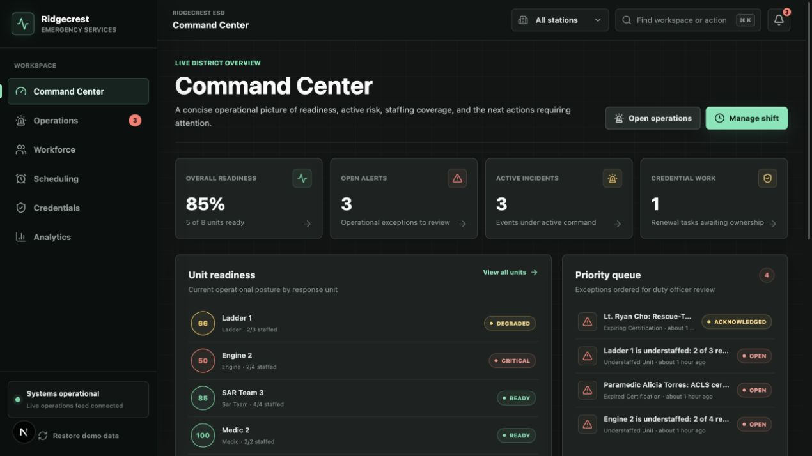
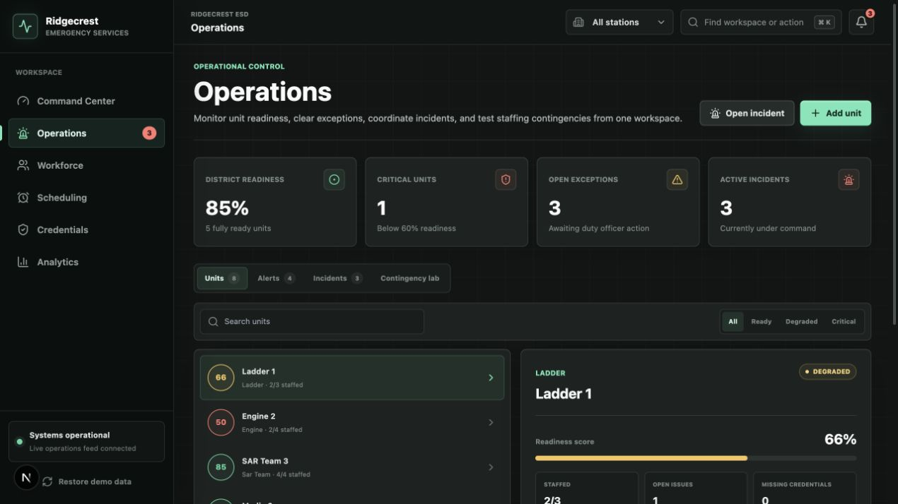
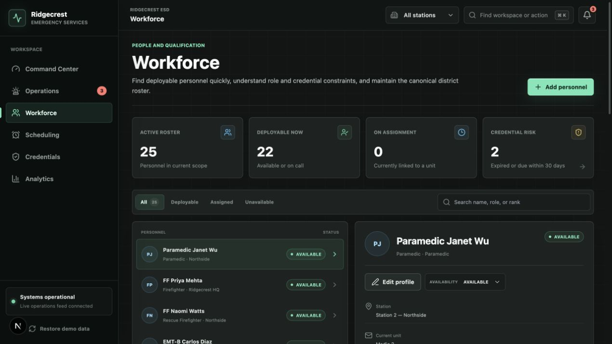
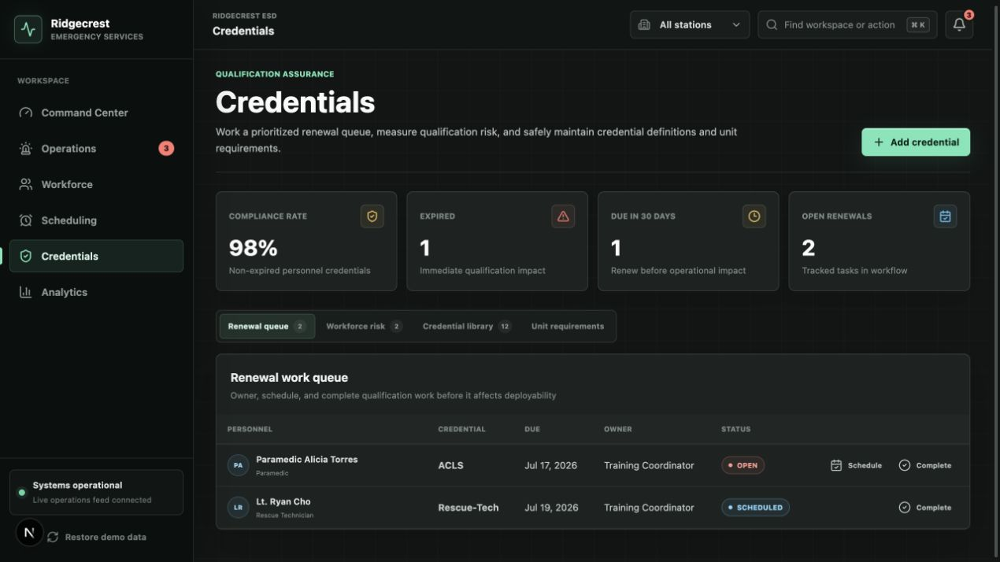
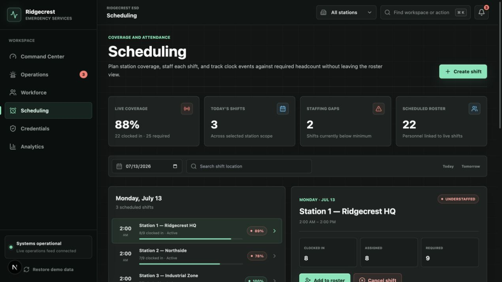
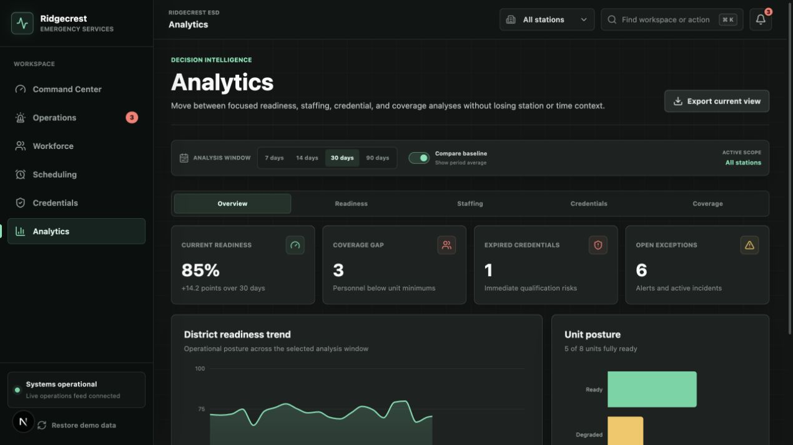

# Emergency Readiness Platform

A full-stack emergency operations command center built to demonstrate production-grade architecture: durable local operations, real-time WebSocket push, an event-driven Kafka pipeline, Snowflake warehouse analytics, and a FastAPI + Next.js application layer — all grounded in realistic emergency-services domain logic.

**Live demo district:** Ridgecrest Emergency Services District (3 stations, 8 units, 25 personnel, seeded automatically on startup).

## Command Center View


## Operations Board View


## Workforce View


## Credentials View


## Shifts View


## Analytics View


---

## Tech Stack

| Layer | Technology |
|---|---|
| Frontend | Next.js 16 · React 19 · TypeScript · TanStack Query · Zod · Radix UI · Recharts |
| API | FastAPI · Pydantic v2 · Python 3.11+ |
| Streaming | Apache Kafka (Confluent) · WebSockets (3 channels) |
| Warehouse | Snowflake · Streams & Tasks · SQL aggregation pipeline |
| Data store | SQLite durable entity store (local) · Snowflake RAW schema (warehouse) |

---

## Architecture

```
Browser ──WebSocket──▶ FastAPI ──Kafka producer──▶ Snowflake (via Snowpipe)
    │                     │                               │
    └──── typed REST ─────┤                     Streams & Tasks → ANALYTICS views
                          │
                    SQLite entity store
```

Three WebSocket channels:
- `/ws/shifts` — shift-level clock-in/out and alert events
- `/ws/unit-readiness/{unit_id}` — per-unit readiness push
- `/ws/operations` — versioned operational snapshot (5s heartbeat)

## Engineering Harness

Repository operating rules live in [PROJECT_GUIDE.md](./PROJECT_GUIDE.md). The guide links to the maintained architecture, quality gates, execution-plan template, and harness checks.

Run the harness check before merging documentation, architecture, process, or validation changes:

```bash
make check-harness
```

---

## Features

### Operations Board (`/readiness`)
- Master-detail unit workspace with search and readiness-state filters
- Readiness scoring: staffing ratio − cert penalties − expired cert penalties
- Alert queue: OPEN → ACKNOWLEDGED → RESOLVED lifecycle with actor metadata
- Incident command workflow with creation and resolution
- Non-destructive callout and unit-offline contingency simulation
- Conflict- and credential-aware personnel assignment

### Workforce (`/personnel`)
- Searchable roster views for deployable, assigned, and unavailable personnel
- Detailed operational profile with station, unit, credential, and assignment context
- Personnel creation, editing, availability changes, and guarded archival

### Shifts (`/shifts`)
- Date-based shift schedule with station scope and coverage summaries
- Shift creation and cancellation with linked assignment handling
- Roster assignment plus clock-in and clock-out actions
- Durable activity history and live staffing-gap status

### Analytics (`/analytics`)
- Focused Overview, Readiness, Staffing, Credentials, and Coverage tabs
- URL-backed 7/14/30/90-day windows and optional period baseline
- Station-scoped queries that filter at the API boundary
- Readiness trajectories, staffing gaps, credential risk, and live shift coverage
- CSV export for the active analysis view

### Credentials (`/certifications-management`)
- Prioritized renewal queue with owners, scheduling, and completion
- Workforce qualification forecast with task creation
- Dependency-aware certification editing and guarded deletion
- Per-unit qualification requirement matrix

### Alert Lifecycle
```
OPEN → ACKNOWLEDGED (actor + note) → RESOLVED
```
Alert types: `UNDERSTAFFED_UNIT`, `EXPIRED_CERTIFICATION`, `EXPIRING_CERTIFICATION`, `OVERTIME_RISK`, `UNIT_OFFLINE`

### Recommendation Engine
Rules-based engine fires on every readiness check:
- **REASSIGN** — available qualified personnel found for understaffed unit
- **ESCALATE** — no qualified replacements; triggers mutual-aid recommendation
- **RENEW_CERT** — expired or expiring credential requires renewal scheduling

### What-If Simulation
`POST /api/simulations/staffing-gap` — specify personnel to remove or a unit offline scenario; returns original vs. degraded readiness per unit and recommended recovery actions.

---

## API Reference (key endpoints)

```
GET  /api/dashboard/summary          — overall readiness, alerts, incidents, station summaries
GET  /api/alerts                     — all alerts (filter by ?state=OPEN|ACKNOWLEDGED|RESOLVED)
POST /api/alerts/{id}/acknowledge    — acknowledge with actor and note
POST /api/alerts/{id}/resolve        — resolve alert
GET  /api/stations                   — station list
GET  /api/incidents                  — active operational incidents
GET  /api/recommendations            — rules-based recommendations (optional ?unit_id=)
GET  /api/analytics/readiness-trends — readiness by ?days= and optional ?station_id=
GET  /api/analytics/certification-risk — risk by ?days_ahead= and optional ?station_id=
GET  /api/analytics/staffing-gaps    — staffing gap by optional ?station_id=
POST /api/simulations/staffing-gap   — what-if simulation
POST /api/demo/reset                 — reset and re-seed Ridgecrest demo data
GET  /api/readiness/units            — live unit readiness scores
GET  /api/personnel                  — personnel list
GET  /api/certifications/expiring    — certs expiring within N days
```

Full Swagger docs at `http://localhost:8000/docs`.

---

## Local Setup

### Prerequisites
- Python 3.11+
- Node.js 20+
- (Optional) Confluent Kafka credentials
- (Optional) Snowflake account

### Backend

```bash
cd backend
python -m venv venv && source venv/bin/activate
pip install -r requirements.txt
uvicorn app.main:app --reload --port 8000
```

Demo data seeds automatically on startup. Reset at any time:
```bash
curl -X POST http://localhost:8000/api/demo/reset
```

### Frontend

```bash
cd dashboard
npm install
npm run dev
```

Open [http://localhost:3000](http://localhost:3000).

### Validation

```bash
make check-harness
cd backend && python -m unittest discover -s tests -v
cd dashboard && npm run lint && npx tsc --noEmit && npm run build
cd dashboard && npm run test:e2e
```

### Environment Variables

**Backend** (`.env` in `backend/`):
```
KAFKA_BOOTSTRAP_SERVERS=placeholder   # leave as placeholder for local dev
SNOWFLAKE_ACCOUNT=placeholder         # leave as placeholder for local dev
```
When set to `placeholder`, Kafka and Snowflake fall back to mock implementations — the app runs fully without external services.

**Frontend** (`.env.local` in `dashboard/`):
```
NEXT_PUBLIC_API_BASE_URL=http://localhost:8000
```

---

## Snowflake Pipeline (optional)

The `data-pipeline/snowflake/` directory contains SQL scripts for:
1. RAW schema tables (SHIFT_EVENTS, PERSONNEL, UNITS, UNIT_ASSIGNMENTS)
2. Snowpipe ingestion from Kafka
3. Streams and Tasks for automated ETL
4. ANALYTICS views (SHIFT_COVERAGE_HOURLY, UNIT_READINESS_AGGREGATES)

See [SNOWFLAKE_SETUP.md](./SNOWFLAKE_SETUP.md) for configuration steps.

---

## Project Structure

```
├── backend/
│   └── app/
│       ├── api/           # REST routes (shifts, readiness, operations)
│       ├── services/      # Readiness, certification, recommendation, demo, Kafka, Snowflake
│       ├── websocket/     # WebSocket connection managers
│       ├── models.py      # Pydantic domain models
│       ├── persistence.py # SQLite-backed entity persistence
│       ├── stores.py      # Typed durable domain stores
│       └── main.py        # FastAPI app, startup seed, WebSocket endpoints
├── dashboard/
│   ├── app/                # Route workspaces and shared visual system
│   ├── components/         # Command shell and reusable UI primitives
│   ├── hooks/              # Live operations stream integration
│   └── lib/                # Typed API client, schemas, and utilities
└── data-pipeline/
    └── snowflake/                         # SQL pipeline scripts
```

---

## License

MIT © Devon Arnone
