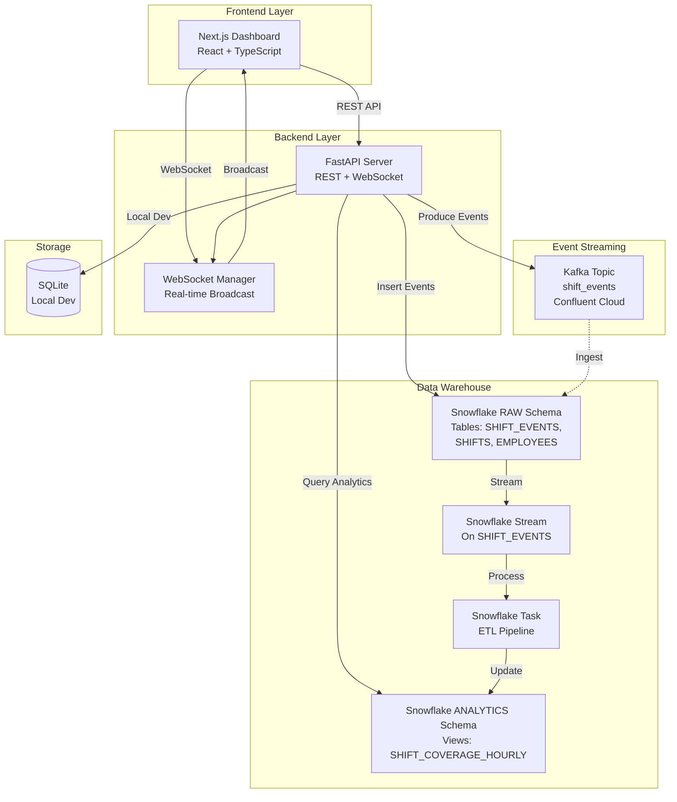

# Architecture Documentation

## System Overview

The Workforce & Shift Management Dashboard is built on a modern, event-driven architecture that combines real-time updates, event streaming, and data warehousing for comprehensive workforce analytics.

## High-Level Architecture



## Data Flow

### 1. Real-Time Event Flow

```
User Action (Clock In/Out)
    ↓
FastAPI Endpoint
    ↓
┌─────────────────────────────────┐
│ 1. Persist to SQLite (dev)      │
│ 2. Produce to Kafka topic        │
│ 3. Broadcast via WebSocket      │
└─────────────────────────────────┘
    ↓
Frontend receives update instantly
```

### 2. Analytics Pipeline

```
Kafka Events (shift_events)
    ↓
Snowflake Ingestion (Snowpipe or direct insert)
    ↓
RAW.SHIFT_EVENTS table
    ↓
Snowflake Stream (captures new rows)
    ↓
Snowflake Task (runs every 5 minutes)
    ↓
ANALYTICS.SHIFT_COVERAGE_HOURLY view
    ↓
FastAPI queries analytics
    ↓
Dashboard displays charts
```

## Component Details

### Frontend (Next.js)

- **Pages**:
  - `/` - Landing page
  - `/shifts` - Real-time shift monitoring
  - `/analytics` - Historical analytics dashboard
- **Real-time Updates**: WebSocket client connects to backend
- **State Management**: React hooks + WebSocket event handlers

### Backend (FastAPI)

- **REST API**: Standard CRUD operations for employees, shifts, assignments
- **WebSocket**: Broadcasts shift events to all connected clients
- **Kafka Producer**: Sends events to `shift_events` topic
- **Snowflake Service**: 
  - Inserts events into RAW schema
  - Queries analytics views for dashboard

### Data Pipeline (Snowflake)

1. **RAW Schema**: Landing zone for all events
   - `SHIFT_EVENTS` - All shift-related events
   - `SHIFTS` - Shift definitions
   - `EMPLOYEES` - Employee master data

2. **Streams**: Capture changes to RAW tables

3. **Tasks**: Automated ETL that:
   - Reads from streams
   - Aggregates data by hour/location
   - Calculates coverage metrics
   - Flags understaffing and overtime risks

4. **ANALYTICS Schema**: Pre-aggregated views for fast queries
   - `SHIFT_COVERAGE_HOURLY` - Hourly coverage by location

## Technology Choices

### Why FastAPI?
- High performance async/await support
- Built-in WebSocket support
- Automatic API documentation
- Type hints with Pydantic

### Why Kafka?
- Decouples event production from consumption
- Scalable event streaming
- Enables future microservices
- Reliable message delivery

### Why Snowflake?
- Serverless data warehouse
- Automatic scaling
- Time-travel and zero-copy cloning
- Streams & Tasks for automated ETL
- Excellent for analytics workloads

### Why Next.js?
- Server-side rendering for SEO
- API routes (if needed)
- Excellent developer experience
- Optimized production builds

## Scalability Considerations

- **Horizontal Scaling**: FastAPI can run multiple instances behind a load balancer
- **WebSocket Scaling**: Use Redis pub/sub for WebSocket broadcasting across instances
- **Kafka**: Handles high-throughput event streaming
- **Snowflake**: Auto-scales compute for analytics queries

## Security

- JWT authentication (to be implemented)
- CORS configuration for frontend origins
- Environment-based secrets management
- Snowflake role-based access control

## Future Enhancements

- Redis for WebSocket broadcasting across instances
- Authentication & authorization (JWT)
- Role-based access (Manager vs Employee)
- Mobile app (React Native)
- Advanced analytics (ML predictions for staffing needs)
- Integration with payroll systems

